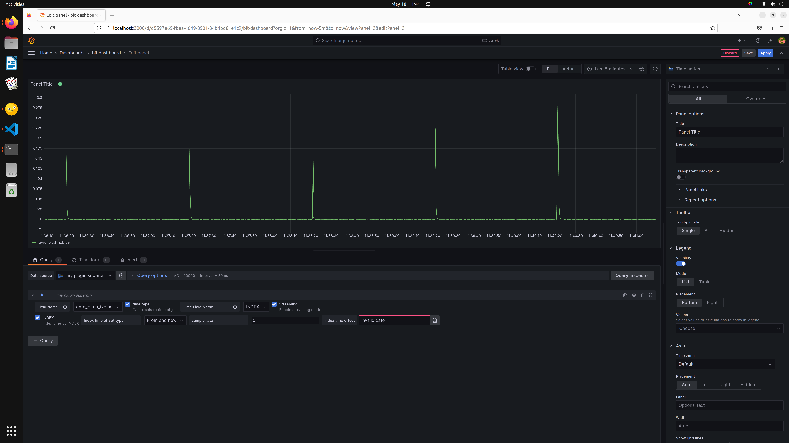
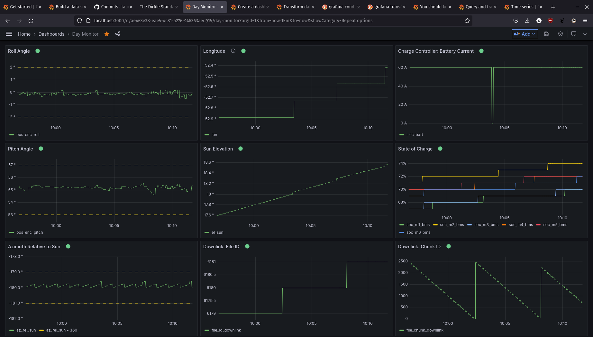

# Grafana GetData backend datasource plugin #

A Grafana plugin which supports the [Dirfile standard](https://getdata.sourceforge.net/dirfile.html) through the reference [GetData implementation](https://github.com/ketiltrout/getdata). This is a [backend datasource plugin](https://grafana.com/docs/grafana/latest/developers/plugins/backend/) which support [streaming](https://grafana.com/docs/grafana/latest/setup-grafana/set-up-grafana-live/).

| Query sample | Dashboard sample |
| ------------ | ---------------- |
|  |  |

**Documentation is given in the [docs](docs/README.md)**